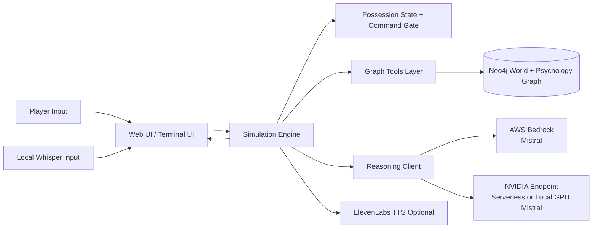
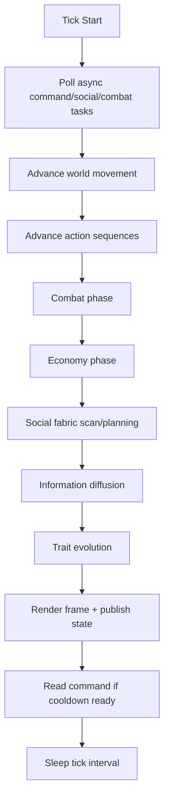
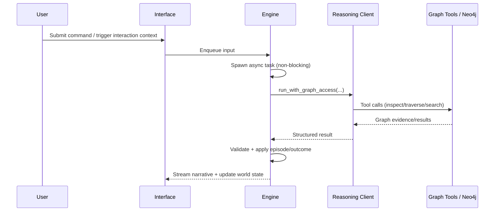

# AEGIS

> **You are not the main character.**

AEGIS (Autonomous Emergent Game Intelligence System) is an AI-driven simulation game where you do **not** directly control a hero. You play as an external possessing force that can issue commands to a host, while the host and surrounding NPC community continue living autonomous lives.

At one level, AEGIS is a game loop about influence, trust, resistance, and consequences. At another level, it is an extensible social simulation substrate that can evolve into a testbed for modeling community behavior under different environmental conditions.

---

## What AEGIS is

AEGIS combines:

- **A real-time world simulation** (movement, interactions, combat, economy, information diffusion).
- **A social graph memory model** (Neo4j-backed world and psychology state).
- **LLM-mediated reasoning with graph tool access** for command outcomes and social episodes.
- **Possession mechanics** where the host has agency, preferences, and resistance.
- **Web and terminal interfaces** for live narrative and command entry.

This project intentionally prioritizes emergent behavior over scripted outcomes.

---

## Core idea: influence, not puppetry

In AEGIS, your host is compelled to act but not reduced to a mindless avatar. The host's traits, relationships, memories, and current context shape **how** your commands are interpreted and executed.

That gives AEGIS its central tension:

- You can command actions.
- You cannot command internal feelings directly.
- The host and the world react over time.
- Social consequences accumulate.

This design supports both dramatic gameplay and deeper simulation experiments.

---

## Inference architecture options

AEGIS supports two runtime reasoning paths:

### 1) Cloud inference via AWS Bedrock

- Set `REASONING_PROVIDER=bedrock`
- Uses Bedrock runtime with your configured Mistral model ID (default: `mistral.mistral-large-2407-v1:0`)
- Good for managed reliability and easier scaling

### 2) NVIDIA path (local GPU-served Mistral or NVIDIA-hosted endpoint)

- Set `REASONING_PROVIDER=nvidia`
- The NVIDIA client talks to an OpenAI-compatible `/chat/completions` endpoint via:
  - `NVIDIA_BASE_URL`
  - `NVIDIA_REASONING_MODEL_ID`
  - `NVIDIA_API_KEY`

This lets you run:

1. **NVIDIA cloud/serverless inference** (default base URL in `.env.example`), or
2. **Local inference** by serving Mistral on your own NVIDIA GPU (for example via NIM/vLLM-compatible endpoint) and pointing `NVIDIA_BASE_URL` to that local server.

---

## Architecture diagrams

### 1) Runtime topology



### 2) Simulation tick pipeline (high level)



### 3) Asynchronous command + social interaction flow



---

## Current stack

- **Simulation runtime:** Python
- **World/psychology graph:** Neo4j
- **Reasoning LLM:** Bedrock or NVIDIA endpoint
- **Speech synthesis:** ElevenLabs (optional)
- **Voice input:** local Whisper path with fallback behavior
- **UI:** web interface (default) + terminal interface

Fine-tuning is intentionally not in the runtime path yet.

---

## Quick start (Windows PowerShell)

### 1) Create environment and install dependencies

```powershell
python -m venv .venv
.\.venv\Scripts\Activate.ps1
python -m pip install --upgrade pip
pip install -r requirements.txt
```

### 2) Configure environment variables

```powershell
Copy-Item .env.example .env
```

Edit `.env` and set real credentials for the provider path you choose.

Required for all runs:

- `NEO4J_URI`
- `NEO4J_USER`
- `NEO4J_PASSWORD`

If using Bedrock (`REASONING_PROVIDER=bedrock`):

- `AWS_REGION`
- `AWS_ACCESS_KEY_ID`
- `AWS_SECRET_ACCESS_KEY`
- Optional `AWS_SESSION_TOKEN`
- Optional `BEDROCK_REASONING_MODEL_ID`

If using NVIDIA path (`REASONING_PROVIDER=nvidia`):

- `NVIDIA_API_KEY`
- `NVIDIA_BASE_URL`
- `NVIDIA_REASONING_MODEL_ID`

Optional speech/TTS:

- `ELEVENLABS_API_KEY`
- `ELEVENLABS_VOICE_ID`
- `ELEVENLABS_MODEL_ID`

Useful runtime overrides:

- `LOG_LEVEL` (`DEBUG`, `INFO`, `WARNING`, `ERROR`)
- `INTERFACE_MODE` (`web` or `terminal`)
- `WEB_HOST`, `WEB_PORT`
- `SIMULATION_TICK_HZ`

### 3) Run

```powershell
python main.py
```

If web mode is enabled, open `http://127.0.0.1:8765` (or your configured host/port).

Type `quit` or `exit` to stop.

---

## Gameplay and simulation loop (high level)

Each tick, AEGIS advances:

1. World state and movement
2. Action sequences and command effects
3. Social interaction planning and multi-turn episodes
4. Combat and economy phases
5. Information diffusion and trait evolution
6. Rendering + event stream publication

Command flow is asynchronous so long reasoning calls do not stall the entire simulation loop. Social interactions are also planned asynchronously with participant-level locking to keep world updates smooth.

---

## Interfaces

### Web UI (default)

- Live minimap and world updates
- Narrative stream
- Event panel
- Push-to-talk command workflow (`#` prefix)
- Async state visibility for processing and social scans

### Terminal mode

- Text-first rendering
- Useful for diagnostics and low-overhead runs

---

## Logging and diagnostics

- Startup and configuration logs
- Websocket/interface lifecycle logs
- Command dispatch and completion logs
- Simulation and cooldown transition logs
- Neo4j transient retry behavior logs

Set `LOG_LEVEL=DEBUG` for verbose traces.

---

## Project layout

```text
aegis/
  ai/
    bedrock.py
    elevenlabs_speech.py
    nvidia_reasoning.py
  graph/
    connection.py
    primitives.py
    tools.py
  interface/
    text_ui.py
    web_ui.py
    voice_input.py
  simulation/
    engine.py
    possession.py
    spatial.py
  config.py
  main.py
main.py
requirements.txt
.env.example
spec.md
```

---

## Security and secrets

- Do not commit `.env`.
- Keep `.env.example` as placeholders only.
- Rotate cloud keys if leaked.
- Prefer least-privilege credentials for Bedrock and Neo4j.

---

## Roadmap direction

Beyond game progression, AEGIS can evolve into a community simulation platform where environmental conditions are changed and outcomes observed. Future directions include:

- Resource scarcity and shock events
- Migration and settlement pressure
- Information reliability and rumor stress tests
- Governance and faction adaptation
- Long-horizon social resilience metrics

In short: AEGIS is both a possession game and a foundation for studying emergent community behavior in dynamic worlds.